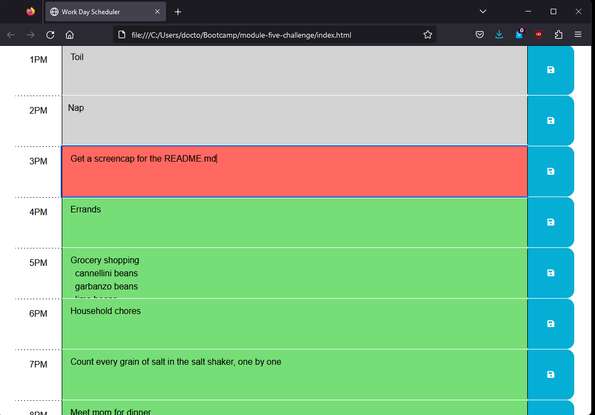
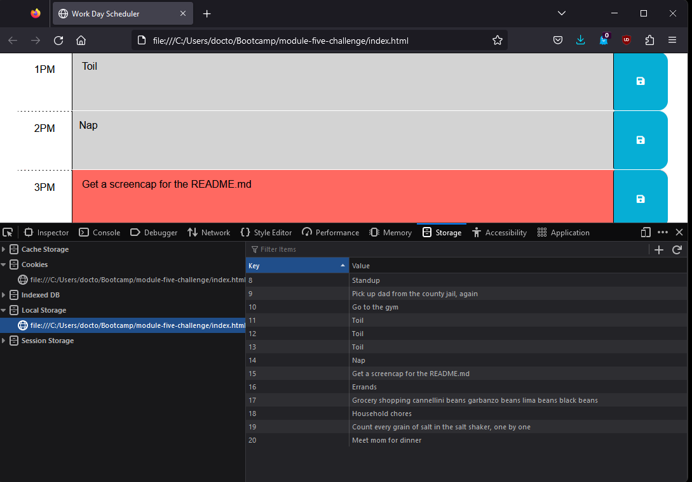

# Work Day Scheduler

The Work Day Scheduler is a daily planner app that allows users to organize their day by enabling them to write tasks down in text fields and retrieve the tasks, even after they close their browser. The Scheduler covers 13 hours, from 8:00 AM to 8:00 PM, with a single text field for each hour. The fields are color-coded, so users can see at a glance what's in the future and what's in the past.

## Screenshots

